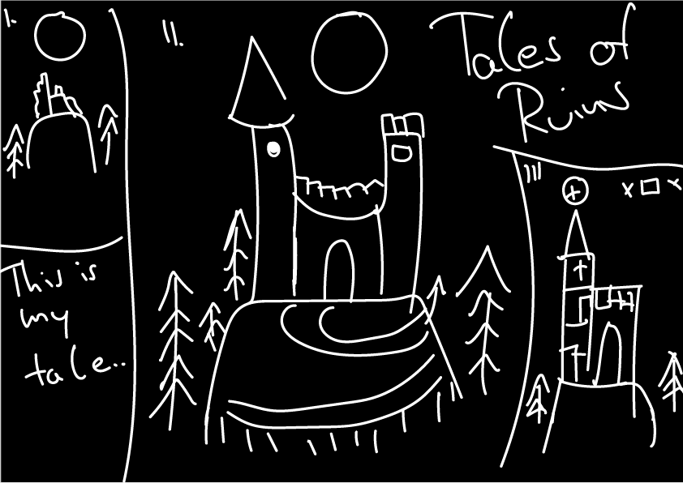

# TalesOfRuinGOTY
_Eine unscheinbare Ruine thront auf einem sanften Hügel und erzählt dem Spieler ihre ehrwürdige Geschichte. Vor etlichen Jahrhunderten ragte sie als stolze Festung empor. Ihre Geschichte ist eine bittersüße Erzählung von vergangener Pracht und dem schicksalhaften Untergang, ein berührendes Zeugnis ihrer goldenen Ära..._
___
## TODO
- _Topic - (Bearbeiter) |✔-Done|🚧-In Progress|❌-Canceled|_
- Inspirationsquellen sammeln - (Alle) 🚧
- Konzeptzeichnungen anfertigen - (Krone) 🚧
- [Sprites](#Sprites) (Hintergründe, Räume) - (Krone Head, Freiwillige) 🚧
  - Abhängig v. Spielsystem Konzept & Code Konzept 🚧
- [Musik](#Musik) - (Krone, Thien, Sven) 🚧
  - Soundeffekte - (Thien)  🚧
- [Story](#Story), Dialoge der Festung - (Krone, Freiwillige) 🚧
- [Spielsystem Konzept/Plan](#Gameplay) anfertigen (Ressourcen, Spielablauf, etc.) - (Alle) 🚧
  - Grobes Konzept - (Krone) ✔
  - Konzept verfeinern - (Krone, Sven) ✔
  - Konzept nochmal verfeinern? 
  - Konzept finalisieren - (Alle) 🚧
- [Code Konzept](#Code) aus Spielsystem Konzept erstellen - (Alle) 🚧
  - Grobes Konzept - (Alle) 🚧
  - Konzept verfeinern - (Alle) 🚧
  - Konzept finalisieren - (Alle) 🚧
- Meilensteine für Code definieren - (Alle) 🚧
- Git Repo einrichten - (Sven) ✔
  - Github Desktop & Gamemaker bei Krone einrichten - (Sven) 🚧
  - Github Desktop & Gamemaker bei Flo einrichten - (Sven) 🚧
  - Wie benutzen wir Git? Konventionen Do's & Don't's - (Thien) 🚧
- Gamemaker Einführung - (Krone) 🚧
- Kameras & Viewports - (Alle) 🚧
___
## Gameplay:
Der Spieler erweckt die Burg von Grund auf zum Leben, Stein um Stein erhebt sich das majestätische Gebäude 'gen Himmel. Jeder neu geschaffene Raum birgt verschiedene Ressourcen, die dazu dienen, die Festung zu erweitern und sich gegen unaufhaltsame Gefahren zu rüsten. Belagerungen, Seuchen und der unaufhaltsame Zerfall bedrohen fortwährend die Existenz der Burg. Das Spiel kulminiert stets im unausweichlichen Untergang – die Frage bleibt lediglich, wie lange der Spieler diesem Schicksal trotzen kann. 

___
## Sprites
Ein Abschnitt für das Thema: _Sprites_
___
## Musik
Ein Abschnitt für das Thema: _Musik_
___
## Story
_Eine unscheinbare Ruine thront auf einem sanften Hügel und erzählt dem Spieler ihre ehrwürdige Geschichte. Vor etlichen Jahrhunderten ragte sie als stolze Festung empor. Ihre Geschichte ist eine bittersüße Erzählung von vergangener Pracht und dem schicksalhaften Untergang, ein berührendes Zeugnis ihrer goldenen Ära. Der Spieler erweckt die Burg von Grund auf zum Leben, Stein um Stein erhebt sich das majestätische Gebäude 'gen Himmel. Jeder neu geschaffene Raum birgt verschiedene Ressourcen, die dazu dienen, die Festung zu erweitern und sich gegen unaufhaltsame Gefahren zu rüsten. Belagerungen, Seuchen und der unaufhaltsame Zerfall bedrohen fortwährend die Existenz der Burg. Das Spiel kulminiert stets im unausweichlichen Untergang – die Frage bleibt lediglich, wie lange der Spieler diesem Schicksal trotzen kann._
___
## Code
Ein Abschnitt für das Thema: _Code_
___
###### Einfach jetzt schon game of the year
